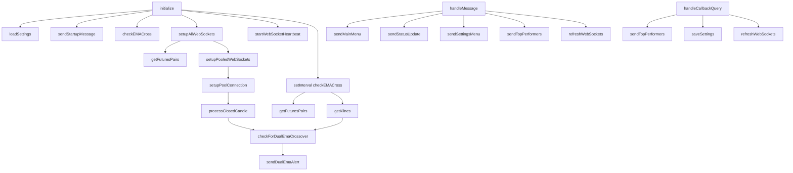

# EMA Tracker Architecture Audit (Developer + Tester View)

## Scope
- File reviewed: `main.js`
- Focus: menu actions (`top gainers/losers/volume`), volume filtering, WebSocket confidence, Delta-vs-Bybit alignment
- Method: static code review + live REST/WebSocket probes

## Quick Verdict
- **Core bot works, but it is Bybit-native, not Delta-native.**
- **Top performers path is technically correct for Bybit**, but exchange mismatch can create trust issues if you expect Delta market behavior.
- **WebSocket connectivity is healthy** for both Bybit and Delta endpoints in probe tests.
- **Main risk:** architecture mixes exchange assumptions across labels/config and can confuse operators.

## Live Probe Results
- Bybit REST tickers: `200`, result list populated.
- Delta India REST tickers: `200`, result list populated.
- Bybit WebSocket (`kline.5.BTCUSDT`): subscribe + data received.
- Delta WebSocket (`v2/ticker` on `BTCUSD`): subscribe + data received.

## Functional Call Graph (Current Implementation)

## What Is Working Well
- `sendTopPerformers` logic is straightforward and now has response-shape validation + empty-data guard.
- WebSocket pool model is scalable and avoids one-socket-per-symbol overload.
- Backup periodic check (`checkEMACross`) increases resilience if socket gaps occur.
- Alert cooldown/state persistence (`alert_state.json`) prevents duplicate blasts after restarts.
- Recent fast-timeframe enhancements are properly centralized with `getDualEmaTimeframes()`.

## What Is Not Fully Aligned / Risky
- Exchange identity mismatch:
  - Logs/help/intent mention Delta in your operations context, but runtime market data source is Bybit endpoints/sockets.
  - This can cause confidence issues even if bot is technically functioning.
- Top menu confidence issue is likely operational, not endpoint outage:
  - If Telegram is busy/rate-limited or chat mismatch occurs, top responses can be missed.
  - Before this audit, top handler lacked strict response-shape check (now added).
- Migration risk:
  - `getFuturesPairs`, `getKlines`, `get24HrStats`, `getOIDelta`, and WS topic parser are all Bybit-formatted.
  - Delta uses different symbol/channel conventions (`BTCUSD`, `v2/ticker`, `candlestick_*`).

## Changes Applied During This Audit
- Hardened top performer fetch:
  - Added API response-shape validation in `sendTopPerformers`.
  - Added safe no-data response message.
- Fixed stale cache cleanup risk:
  - Symbol cleanup now clears dynamic timeframe keys (`1m/3m/5m/15m` as applicable), not only `5m/15m`.

## Confidence Rating (Current)
- Bot stability: **7.5/10**
- Alert timing confidence: **7/10** (good architecture, but exchange-alignment ambiguity remains)
- Operator clarity / maintainability: **6/10** (single large file, mixed concerns)

## Structured Improvement Plan (Non-Breaking First)
1. **Add exchange adapter layer** in front of data fetch/WS subscribe calls:
   - `exchangeClient.getTickers()`, `getCandles()`, `subscribeCandles()`.
2. **Introduce `EXCHANGE=bybit|delta` switch** (default bybit initially).
3. **Keep strategy engine unchanged**:
   - EMA/crossover/alerts stay the same, only market-data provider swaps.
4. **Create smoke-test commands**:
   - `/diag top`, `/diag ws`, `/diag pairs` to send bot health snapshots into Telegram.
5. **Split `main.js` gradually**:
   - `telegram-controller`, `strategy-engine`, `exchange-clients/bybit`, `exchange-clients/delta`.

## Questions Before Full Delta Migration
- Should I make Delta the default exchange now, or keep Bybit default with a safe toggle?
- For Delta mode, should symbols be strictly `BTCUSD/ETHUSD` style, or do you want product-id based subscriptions?
- Do you want top gainers/losers/volume sourced from Delta only when Delta mode is ON?
